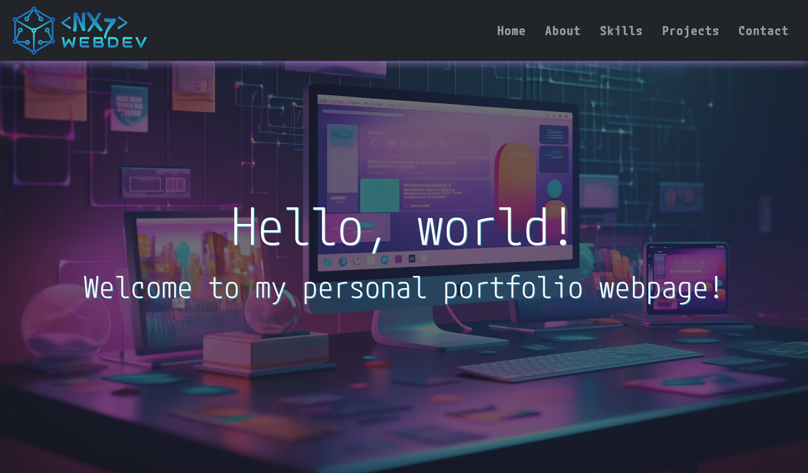
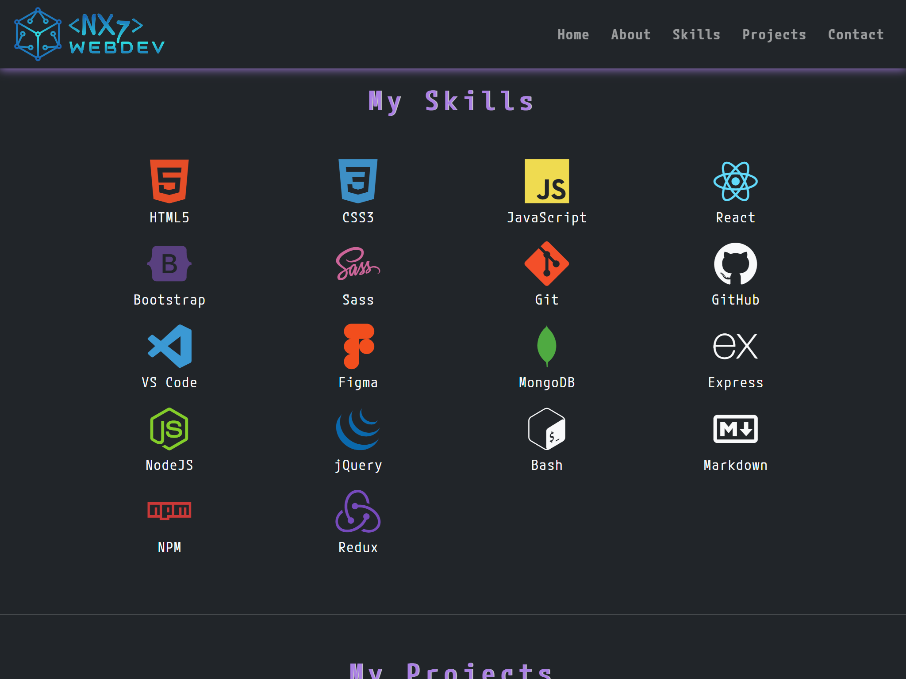

# Personal Portfolio Webpage

### My Solution:

[nix7amcm.github.io/FCC-Personal-Portfolio-Webpage/](https://nix7amcm.github.io/FCC-Personal-Portfolio-Webpage/)

* * *

## Images:

#### <u>Desktop</u>

#### <u>Tablet</u>

#### <u>Mobile</u>

* * *

### Project Description:

**Objective:** Build an app that is functionally similar to this: [https://personal-portfolio.freecodecamp.rocks](https://personal-portfolio.freecodecamp.rocks). 

**Do not copy this demo project.**

Fulfill the user stories and pass all the tests below to complete this project. Give it your own personal style. Happy Coding!

 * * *

### User Stories:

- [x] #1 Your portfolio should have a welcome section with an `id` of `welcome-section`
- [x] #2 The welcome section should have an `h1` element that contains text
- [x] #3 Your portfolio should have a projects section with an `id` of `projects`
- [x] #4 The projects section should contain at least one element with a `class` of `project-tile` to hold a project
- [x] #5 The projects section should contain at least one link to a project
- [x] #6 Your portfolio should have a navbar with an id of `navbar`
- [x] #7 The navbar should contain at least one link that you can click on to navigate to different sections of the page
- [x] #8 Your portfolio should have a link with an id of `profile-link`, which opens your GitHub or freeCodeCamp profile in a new tab
- [x] #9 Your portfolio should have at least one media query
- [x] #10 The height of the welcome section should be equal to the height of the viewport
- [x] #11 The navbar should always be at the top of the viewport

* * *

### Additional Notes:

**Note:** Be sure to add `<link rel="stylesheet" href="styles.css">` in your HTML to link your stylesheet and apply your CSS

* * *
